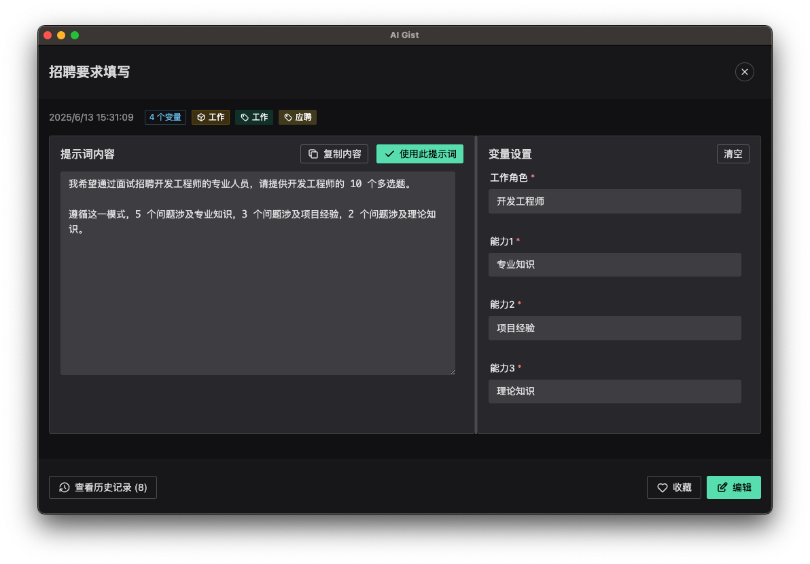
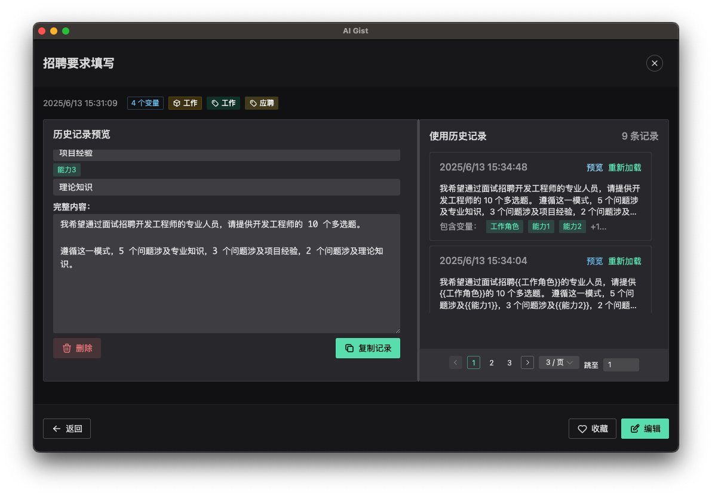
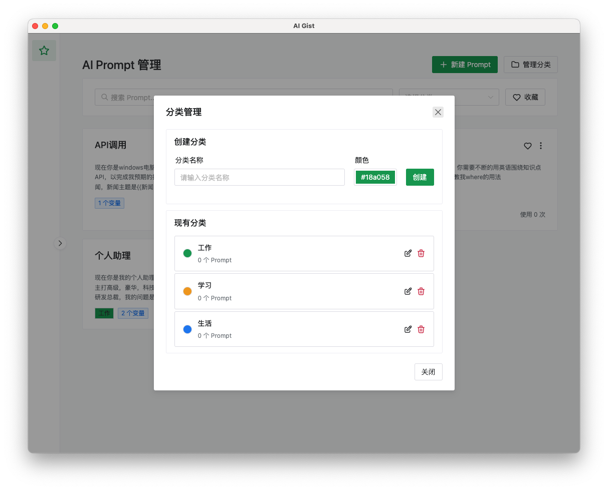

<div align="center">

# AI Gist

AI Prompt 管理工具，能够利用 AI 快速生成高质量的 AI Prompt + 维护 Prompt 列表 + Prompt 变量填充。

</div>



## 快速开始

点击页面上方绿色的 **Use this template** 按钮，创建一个属于你自己的仓库。

**或者**

直接克隆此仓库：`git clone https://git.yarinz.com/yarin-zhang/electron-vue-template.git`

### 安装依赖 ⏬

```bash
yarn install
```

### 初始化数据库 🗄️

```bash
yarn prisma generate
yarn prisma db push
```

### 启动开发环境 ⚒️

```bash
yarn dev
```

## 其他常用命令

```bash
# 开发相关
yarn dev            # 启动应用并开启热重载
yarn build          # 打包应用，输出目录为 "dist"

# 数据库相关
yarn prisma studio  # 打开 Prisma 数据库管理界面
yarn prisma generate # 生成 Prisma 客户端
yarn prisma db push # 推送 schema 变更到数据库
yarn prisma migrate # 创建和应用数据库迁移

# 跨平台构建
yarn build:win      # 构建 Windows 安装包
yarn build:mac      # 构建 macOS 安装包
yarn build:linux    # 构建 Linux 安装包
```

更多配置选项请参阅 [Electron Builder CLI 文档](https://www.electron.build/cli.html)。


## 开发指南

详细的开发指南请参阅 [docs](./docs) 目录：

- [tRPC 和 Prisma 使用指南](./docs/trpc-prisma-guide.md)
- [数据库模型管理](./docs/database-models.md)
- [API 接口开发](./docs/api-development.md)

## 使用静态资源

如果你有一些文件需要在安装后复制到应用目录，请将它们放入 `src/main/static` 目录中。

该目录中的文件仅对主进程可访问，类似于 `src/renderer/assets` 目录中的资源只对渲染进程可访问。其使用方式与你在其他前端项目中的经验类似。

### 主进程中引用静态资源

```ts
/* 假设文件 src/main/static/myFile.txt 存在 */

import { app } from 'electron';
import { join } from 'path';
import { readFileSync } from 'fs';

const path = join(app.getAppPath(), 'static', 'myFile.txt');
const buffer = readFileSync(path);
```

## 应用截图




